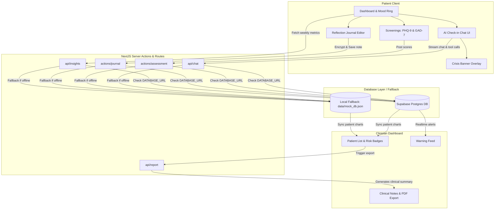

# 🪞 MindMirror — Continuous Care Mental Health Platform

**"Fitbit for Mental Health"** — A warm, non-clinical consumer experience on the surface, backed by clinical-grade triage rigor underneath. 

MindMirror replaces boring mood sliders with a **60-second conversational AI check-in** that adaptively tracks mood, sleep, energy, and triggers. If baseline drift or crisis keywords are detected, the system immediately alerts the user's licensed therapist with objective metrics.

---

## 🎯 PRODUCT VISION
Traditional mental healthcare is **episodic**—patients check in once every few weeks, and clinical decisions rely on subjective, retrospectively recalled inputs. MindMirror introduces **continuous care**, gathering day-to-day emotional metrics in a safe, warm environment, and looping in therapists in real time when clinical thresholds are crossed.

---

## 🛠️ TECH STACK

- **Framework:** Next.js 14 (App Router, Server Actions, React Server Components)
- **Database & Auth:** Supabase (Postgres + Row-Level Security)
- **Database ORM:** Drizzle ORM (type-safe queries & mutations)
- **AI Core:** Vercel AI SDK + Google Gemini 1.5 Flash (with fallback mock-streaming tool calling engine)
- **Visualization:** Recharts (responsive area charts)
- **Data Export:** `@react-pdf/renderer` (server-side compiled clinical PDF exports)
- **Calming Aesthetics:** Framer Motion (animated breathing box guides) + Tailwind CSS

---

## 📐 TECHNICAL ARCHITECTURE



---

## 🔐 PRIVACY & SECURITY FEATURES (HIPAA & GDPR Ready)
1. **End-to-End Encryption at Rest:** Patient journal entries are encrypted on the server using **AES-256-CBC** before being saved to the database. They are only decrypted on-demand when loaded by the authenticating patient.
2. **Anonymized AI Prompts:** Hashed user identifiers are transmitted to AI endpoints. PII (Name, Email) is never exposed to LLM context windows.
3. **GDPR Compliance:** A single-click "Permanently Delete My Data" zone completely purges the user profile, mood logs, screening histories, and alerts from both active servers and JSON storage.

---

## 🚀 QUICK START GUIDE

### 1. Prerequisites
Ensure you have **Node.js v18+** and **npm** installed.

### 2. Installation
Clone the repository and install dependencies:
```bash
# Enter project folder
cd mindmirror

# Install packages
npm install
```

### 3. Database Seeding (Essential for Demo)
MindMirror runs in **Local Offline Mode** out-of-the-box by automatically setting up a mock database file (`data/mock_db.json`). Run the seeding script to load 30 days of data for our demo users:
```bash
npx tsx scripts/seed.ts
```

### 4. Running the Dev Server
Launch the development environment:
```bash
npm run dev
```
Open [http://localhost:3000](http://localhost:3000) in your browser.

---

## 👥 SEEDED DEMO ACCOUNTS

We have preloaded the database with a realistic 30-day timeline showing a mid-month burnout dip and recovery. Use these credentials to test:

### 1. Patient Persona: "Priya Sharma"
- **Login Email:** `priya@example.com`
- **Password:** *Any characters (in Local Offline Mode)*
- **Demo Highlights:**
  - View the pulsing **Mood Ring** to trigger a check-in.
  - Review the **90-Day Mood Heat Calendar** showing daily density.
  - Examine the **7-Day Trend Chart** displaying emotional score vs. physical energy.
  - Practice mindfulness using the interactive **Box Breathing guide** (4s inhale, hold, exhale, hold animation).

### 2. Therapist Persona: "Dr. Sharma"
- **Login Email:** `sharma@example.com`
- **Password:** *Any characters (in Local Offline Mode)*
- **Demo Highlights:**
  - View Priya Sharma in the **Patient Directory** with an aggregated risk rating.
  - Triage the **Warning Feed** alerting you of Priya's severe assessment scoring from week 2.
  - Review the patient detail logs.
  - Download a formatted clinical health record via the **Download PDF Report** action.

---

## 🎤 5-SLIDE PITCH DECK

### 🎬 Slide 1: The Problem
**Episodic Care is Broken.**
Mental health tracking today is highly reactive. Patients report symptoms during bi-weekly therapist sessions based on subjective recall. Baseline drift (sleep drops, energy levels, stress factors) goes unnoticed until a crisis occurs.

### 🍃 Slide 2: The Solution
**Continuous Care, Not Episodic.**
MindMirror acts as the "Fitbit for Mental Health". It provides a warm, non-clinical consumer companion that translates casual check-ins into structured data. It maintains a continuous care loop, auto-detecting anomalies and linking patients to their healthcare providers before a crisis escalates.

### 🔬 Slide 3: The Star Feature
**Empathetic AI Conversational Check-ins.**
MindMirror replaces boring sliders with an empathetic AI assistant. Using standard LLM tool calling, it extracts emotional metrics `{mood, sleep, energy, anxiety, tags}` in real time. It features a regex-based crisis interceptor to handle self-harm immediately and logs clinical warnings.

### 💻 Slide 4: Technology & Architecture
**Modern, HIPAA-aligned Stack.**
- NextJS 14 (App Router & Server Actions)
- Supabase (PostgreSQL with RLS policy locks)
- Drizzle ORM
- Vercel AI SDK
- `@react-pdf/renderer` for professional medical report packaging

### 🔮 Slide 5: The Future
**Predictive Preventative Scale.**
- Integrating wearable biometrics (HRV, sleep stages via Apple Health/Fitbit).
- Speech biomarker analysis to monitor vocal indicators of depressive onset.
- Personalized ML baseline drift models that raise warnings based on individual standard deviations rather than fixed scoring cutoffs.
# MindMirror
# MindMirror
